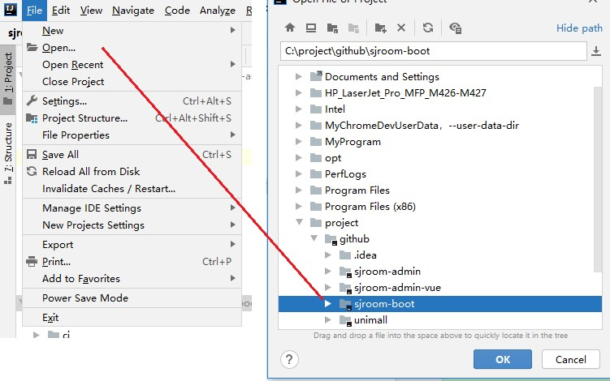
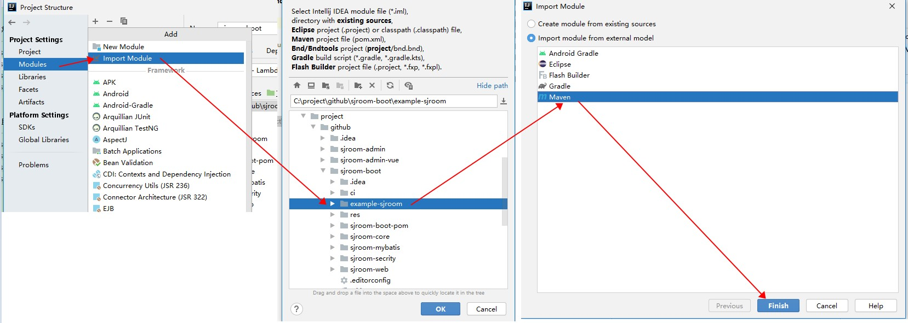
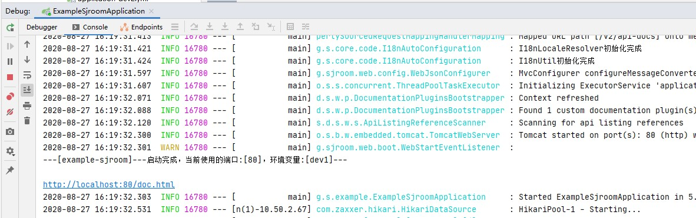
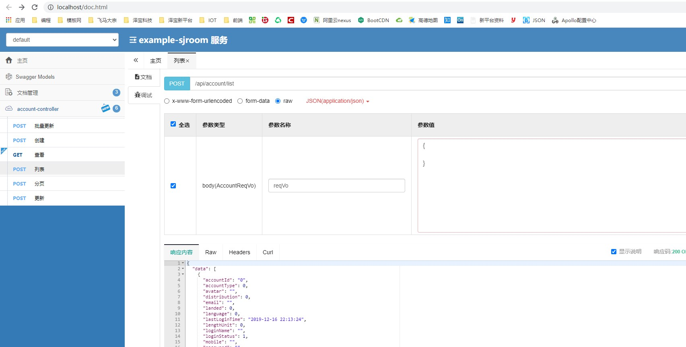

# sjroom boot
## 简介
 是一个轻量级的 spring boot 的敏捷开发基础框架，能快速开发项目并交付，完善的 XSS 防范及脚本过滤，彻底杜绝 XSS 攻击，实现前后端分离，通过 token 进行数据交互。

##  功能列表
| 功能                   | 描述                                | 状态    |
| ------------------------ | ----------------------------------- | ------- |
| sjroom-boot-pom     | 父依赖，版本、插件等版本和依赖管理  | 完成    |
| sjroom-mybatis    | mybatis 代码生成和基础依赖          | 完成    |
| sjroom-core       | 核心功能组件集，utils、基础组件接口 | 完成 |
| sjroom-web | web相关的json封装，swagger处理以及validation验证               | 完成 |

## 组件模块
| 组件名                   | 描述                                | 状态    |
| ------------------------ | ----------------------------------- | ------- |
| sjroom-boot-pom     | 父依赖，版本、插件等版本和依赖管理  | 完成    |
| sjroom-mybatis    | mybatis 代码生成和基础依赖          | 完成    |
| sjroom-core       | 核心功能组件集，utils、基础组件接口 | 完成 |
| sjroom-web | web相关的json封装，swagger处理以及validation验证               | 完成 |

## 快速开始
#### 下载代码
```xml
git clone https://gitee.com/zw23534572/sjroom-boot.git
```
#### 用idea 打开代码


#### 加载example-sjroom 模块


#### 创建数据库
创建数据库 demo ，数据库编码为 UTF-8
执行 res/demo.sql 文件，初始化数据（默认支持MySQL）

#### 启动运行
- 修改 application-dev.yml ，更新MySQL账号和密码

- 运行 github.sjroom.example.ExampleSjroomApplication.java 的 main 方法，则可启动项目

- Swagger路径：http://193.112.125.239:9001/doc.html
